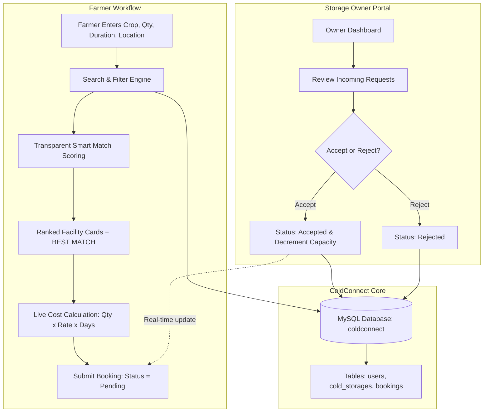

# ColdConnect: Smart Cold Storage Finder & Booking System

> **KALPVRUKSH 2.0 Mini Hackathon &bull; Silver Oak University**  
> **Problem Statement:** P21 – AgriTech EASY: *"Difficulty Finding and Reserving Available Cold Storage"*  
> **Local Prototype URL:** [http://localhost/coldconnect/](http://localhost/coldconnect/)

---

## 1. Problem Statement & Background (P21)

Every harvest season, small and marginal farmers face devastating post-harvest losses (typically 30–40% of perishable crops like tomatoes, potatoes, onions, and fruits). Farmers lack timely, reliable information about:
- Which nearby cold storages actually have **free capacity right now**
- Whether a facility's chamber temperature and humidity suit their specific crop
- Transparent daily rates per kilogram
- Minimum reservation quantities and maximum duration limits
- Exact travel distance and route feasibility

**The Devastating Outcome:** Farmers either risk total crop spoilage or are forced into **distress selling** to exploitative middlemen at throwaway prices (₹1–₹2/kg).

---

## 2. Our Solution: ColdConnect

**ColdConnect** is an accessible, web-based platform connecting farmers with nearby certified cold storage facilities:
1. **Input Produce Details:** Farmers enter crop variety, weight (kg), required storage days, and location.
2. **Transparent "Smart Match" Ranking:** Cold storages are filtered for real-time capacity and crop suitability, then ranked using a **100-point deterministic, rule-based formula** (no opaque blackbox machine learning claims).
3. **Instant Cost Estimation:** Calculates clear projected costs (`Quantity × Daily Price/kg × Duration`) before reservation.
4. **Structured Booking Workflow:** Farmers submit reservation requests with status tracking (`Pending`, `Accepted`, `Rejected`).
5. **Storage Owner Portal:** Cold storage owners review incoming farmer requests, accept/reject reservations, and automatically synchronize available capacity.

---

## 3. Technology Stack

- **Frontend:** Semantic HTML5, Vanilla CSS3 (AgriTech Emerald & Arctic Ice Cyan theme), Vanilla JavaScript (no heavy frameworks, fast 3G/rural friendly).
- **Backend:** PHP 8.2+ (Procedural + Object-Oriented PDO with prepared statements).
- **Database:** MySQL / MariaDB (`coldconnect` database).
- **Security:** `password_hash()` (Bcrypt), session authentication, XSS defense with `htmlspecialchars()`.
- **Server Environment:** XAMPP (Apache + MySQL + phpMyAdmin) running locally at `http://localhost/coldconnect/`.

---

## 4. System Architecture



---

## 5. Transparent Rule-Based Smart Match Algorithm

Unlike blackbox AI models, ColdConnect uses a deterministic 100-point scoring algorithm designed for trust and auditability:

| Factor | Weight | Scoring Criteria |
| :--- | :---: | :--- |
| **Distance** | **30%** | Locality distance matrix: $\le 5\text{km} \to 30\text{pts}$, $\le 10\text{km} \to 26\text{pts}$, $\le 16\text{km} \to 21\text{pts}$, $\le 25\text{km} \to 16\text{pts}$, $> 25\text{km} \to 10\text{pts}$. |
| **Storage Price** | **25%** | Market competitiveness: $\le ₹1.80 \to 25\text{pts}$, $\le ₹2.00 \to 23\text{pts}$, $\le ₹2.20 \to 20\text{pts}$, $\le ₹2.50 \to 17\text{pts}$, $> ₹2.50 \to 10\text{pts}$. |
| **Available Capacity** | **20%** | Capacity buffer ratio ($Capacity / Request$): $\ge 2.0\times \to 20\text{pts}$, $\ge 1.5\times \to 18\text{pts}$, $\ge 1.2\times \to 15\text{pts}$, $\ge 1.0\times \to 12\text{pts}$. |
| **Crop Compatibility** | **15%** | Verified crop certified in `supported_crops`: $15\text{pts}$. Partial/general: $6\text{pts}$. |
| **Temperature Suitability** | **10%** | Facility chamber overlap with crop safe storage range (e.g. Tomato $4^\circ\text{C}-10^\circ\text{C}$): Optimal overlap $\to 10\text{pts}$, Near $\to 7\text{pts}$. |

---

## 6. Project Directory Structure

```text
coldconnect/
│
├── index.php                 # Landing page, problem overview & quick search
├── register.php              # Farmer and Owner account registration
├── login.php                 # Unified authentication with demo quick-fills
├── logout.php                # Safe session termination
│
├── farmer-dashboard.php      # Farmer overview & statistics
├── search.php                # Storage finder with Smart Match ranking
├── storage-details.php       # Facility specifications & dynamic cost slider
├── booking.php               # Reservation submission form
├── my-bookings.php           # Farmer booking history with status badges
│
├── owner/
│   ├── dashboard.php         # Storage owner metrics & facilities overview
│   ├── bookings.php          # Booking requests management table
│   ├── update-booking.php    # Transactional Accept/Reject + capacity update
│   └── update-storage.php    # Facility capacity & rate settings editor
│
├── includes/
│   ├── db.php                # PDO database connection
│   ├── auth.php              # Session auth, role verification, helpers
│   ├── smart-match.php       # Deterministic Smart Match scoring engine
│   ├── header.php            # Shared header, navigation & flash alerts
│   └── footer.php            # Shared footer & hackathon credits
│
├── css/
│   └── style.css             # AgriTech + Cold Storage design system
│
├── js/
│   └── script.js             # Live cost calculator & date synchronization
│
├── docs/
│   ├── architecture.md       # Technical architecture & ER schema
│   ├── demo-flow.md          # Step-by-step presentation script for judges
│   └── judging-points.md     # Hackathon rubric alignment
│
├── database.sql              # Complete MySQL schema + realistic demo seeds
└── README.md                 # Project documentation
```

---

## 7. How to Install & Run with XAMPP

### Step 1: Start XAMPP Services
1. Open the **XAMPP Control Panel**.
2. Click **Start** next to **Apache**.
3. Click **Start** next to **MySQL**.

### Step 2: Database Setup via phpMyAdmin
1. Open your browser and navigate to: [http://localhost/phpmyadmin/](http://localhost/phpmyadmin/)
2. Click on the **Import** tab at the top.
3. Click **Choose File** and select `database.sql` from the project folder (`C:\xampp\htdocs\coldconnect\database.sql`).
4. Click **Import** (or **Go**) at the bottom.
5. You should see a green success notification that database `coldconnect` and 3 tables (`users`, `cold_storages`, `bookings`) have been created.

*Alternative command line import:*
```bash
C:\xampp\mysql\bin\mysql.exe -u root < C:\xampp\htdocs\coldconnect\database.sql
```

### Step 3: Launch the Web Application
Open your browser and visit:
👉 **[http://localhost/coldconnect/](http://localhost/coldconnect/)**

---

## 8. Verified Demo Credentials

| Role | Email | Password | Pre-populated Data |
| :--- | :--- | :--- | :--- |
| **Farmer** | `demo@coldconnect.test` | `demo123` | Ramesh Patel (Ahmedabad), sample bookings |
| **Storage Owner 1** | `owner@coldconnect.test` | `owner123` | Haresh Shah (Shree Cold Storage, Kisan Cold Hub, etc.) |
| **Storage Owner 2** | `mahesh.owner@coldconnect.test` | `owner123` | Mahesh Choudhary (Green Fresh Storage, Sardar Patel Warehouse) |
| **Any New Owner** | Register via `register.php` | Custom | Registers new owner account; can add facilities via `+ Add New Facility` |

*Tip: On the login page, you can click the **"⚡ Fast Hackathon Judge Logins"** buttons to auto-fill any of these accounts with a single click.*


---

## 9. Hackathon Judging Demo Scenario (Problem P21)

Follow these exact steps during judging to demonstrate the complete end-to-end flow:

1. **Step 1 - Search as Farmer:**
   - Go to [http://localhost/coldconnect/](http://localhost/coldconnect/)
   - Click **"✨ Load Judge Demo (Tomato, 500kg)"** button or manually enter:
     - **Crop:** `Tomato`
     - **Quantity:** `500 kg`
     - **Storage Duration:** `15 days`
     - **Location:** `Ahmedabad`
   - Click **"Find Best Storage"**.

2. **Step 2 - Review Smart Match Results:**
   - See multiple storages displayed.
   - **Shree Cold Storage** is highlighted with the **"🌟 BEST SMART MATCH"** badge (90%+ score).
   - Point out the transparent Smart Match explanation: optimal tomato temperature (2°C - 8°C), low distance (~3.5 km), competitive rate (₹2.00/kg/day).
   - Point out estimated cost calculation: **500 kg × ₹2.00 × 15 days = ₹15,000**.

3. **Step 3 - Reserve Storage:**
   - Click **"Book Storage Now"** on Shree Cold Storage.
   - Log in using Farmer credentials (`demo@coldconnect.test` / `demo123`).
   - Click **"Confirm Booking Request"**.
   - View the booking under **My Bookings** with status badge: **⏳ Pending**.

4. **Step 4 - Owner Acceptance & Live Capacity Update:**
   - Log out, then log in as Storage Owner (`owner@coldconnect.test` / `owner123`).
   - In the **Owner Portal**, observe the new 500 kg reservation under **Incoming Booking Requests**.
   - Note Shree Cold Storage available capacity: **800 kg**.
   - Click **"Accept"**.
   - **Result:** Booking status becomes **✅ Accepted**, and available capacity immediately drops from **800 kg &rarr; 300 kg**.

5. **Step 5 - Farmer Verification:**
   - Log back in as Farmer (`demo@coldconnect.test` / `demo123`).
   - Go to **My Bookings** &rarr; status is now confirmed **✅ Accepted** with facility contact phone.

---

## 10. Key Files for Evaluation & Modifications

- **UI & Aesthetic Tokens:** [`css/style.css`](file:///C:/Users/CHINU/.gemini/antigravity-ide/scratch/coldconnect/css/style.css)
- **Smart Match Algorithm:** [`includes/smart-match.php`](file:///C:/Users/CHINU/.gemini/antigravity-ide/scratch/coldconnect/includes/smart-match.php)
- **Database Schema & Demo Seeds:** [`database.sql`](file:///C:/Users/CHINU/.gemini/antigravity-ide/scratch/coldconnect/database.sql)
- **Dynamic Cost Calculator:** [`js/script.js`](file:///C:/Users/CHINU/.gemini/antigravity-ide/scratch/coldconnect/js/script.js)
- **Owner Booking & Capacity Logic:** [`owner/update-booking.php`](file:///C:/Users/CHINU/.gemini/antigravity-ide/scratch/coldconnect/owner/update-booking.php)

---

## 11. Future Roadmap

- **Multi-language Localization:** Gujarati and Hindi voice & text interfaces for non-literate farmers.
- **Micro-warehousing Aggregation:** Pooling smallholder farmers with <50 kg produce for shared cold-storage pallets.
- **IoT Cold-Room Telemetry:** Live temperature and humidity sensor integration inside storage chambers.
- **FPO (Farmer Producer Organization) Bulk Booking:** Enabling village cooperatives to book refrigerated trucks and hubs collectively.

---

## 12. Team & Hackathon Submission

- **Hackathon:** KALPVRUKSH 2.0 Mini Hackathon
- **Institution:** Silver Oak University, Ahmedabad
- **Track:** AgriTech (Problem Statement P21)
- **Team Name:** *[Enter Team Name]*
- **Team Members:**
  - *[Member 1 Name & Roll No]*
  - *[Member 2 Name & Roll No]*
  - *[Member 3 Name & Roll No]*
# AgriStorage

# AgriStorage

# AgriStorage

# coldConnect

