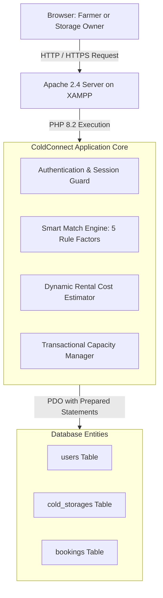
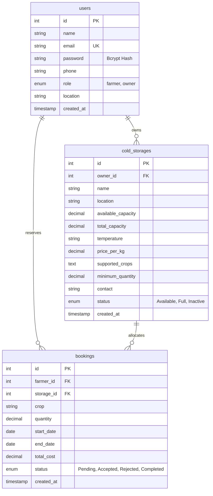

# ColdConnect - Technical Architecture & Schema

## 1. System Overview

ColdConnect is engineered as a lightweight, reliable, high-performance web application designed to run seamlessly in rural and urban agricultural centers. It operates without external paid dependencies, heavy cloud overhead, or complex setup pipelines.



---

## 2. Database Schema & Entity Relationships



---

## 3. Data Integrity & Concurrency Safeguards

1. **Prepared Statements Everywhere:** All database interactions use PDO parameter binding to prevent SQL injection vulnerabilities.
2. **ACID Transaction on Booking Acceptance:** When an owner accepts a reservation, the system initiates a PDO transaction:
   ```php
   $pdo->beginTransaction();
   // 1. Verify capacity >= booking quantity
   // 2. UPDATE bookings SET status = 'Accepted' WHERE id = ?
   // 3. UPDATE cold_storages SET available_capacity = available_capacity - ? WHERE id = ?
   $pdo->commit();
   ```
3. **Session Authentication & Guard Middleware:** Helper routines `requireFarmer()` and `requireOwner()` inspect `$_SESSION['user_role']` on protected pages, preventing privilege escalation.
